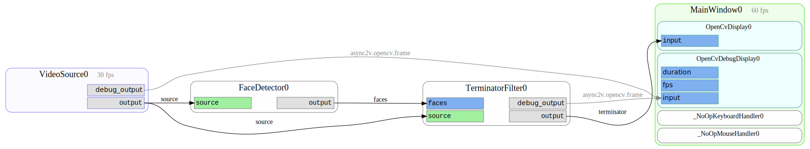

Quickstart
==========

Install ``async2v`` with the extra dependencies needed for ``opencv`` and ``pygame`` support:

::

    pip install async2v[pygame,opencv]

Run one of the examples:

::

    wget https://raw.githubusercontent.com/tom-mi/python-async2v/master/examples/terminator_vision.py
    chmod u+x terminator_vision.py
    ./terminator_vision.py run

Use ``F1`` to show on-screen help.

Use the ``--help`` option to display configuration possibilities and discover available subcommands:

::

    ./terminator_vision.py run --help
    ./terminator_vision.py --help

Get your hands dirty
--------------------

Enough playing around – time to take a closer look at the example. First, create a graph of the
application:

::

    ./terminator_vision.py graph

This creates a graph file in the current directory (``graph.pdf`` as default, try ``--format``).

Each box corresponds to one `Component` instance in the code. With that overview it should be easy to
modify or add components in the example.

That's the end of the Quickstart guide. If you prefer a top-down approach, head over to the
`../concepts` section.
