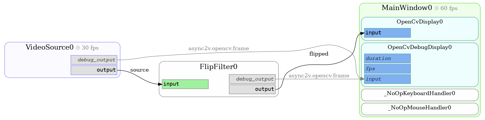

Synchronous Filter
==================

This chapter of the tutorial shows you the implementation of filters (components that have outputs as well as inputs)
which contain the interesting processing logic.

We start with the result of the previous chapter, a simple app with a debug display & a video source.

Add a synchronous filter
------------------------

With *synchronous* we mean that every input image has to pass the filter before we do anything else with it.
A filter is not synchronous per se, it is rather a decision of the subsequent components to take their input solely
from that filter instead of allowing to bypass it. But we'll come to that later.

For now, we just add a new custom `EventDrivenComponent` with one input field and one output field that has the task to
flip input images horizontally.

.. literalinclude:: ../../examples/tutorial/02_01.py
  :language: python
  :emphasize-lines: 15-23,39,40

A lot of things are happening here now. Let's go through them step by step:

* The flip filter is an `EventDrivenComponent`. This means: its ``process`` method is only called when one of its
  *trigger fields* received a new input.
* The filter has one input field, ``input``. It is a `Latest` field, meaning that it always retains the last value it
  received. It has also set ``trigger=True``, making it a *trigger field*.
* The input field listens on the key ``source``. This is the default key the `VideoSource` component pushes its frames
  to.
* The filter has one output field, ``debug_output``. For the sake of simplicity, the output key is set to
  `OPENCV_FRAME_EVENT`, which causes the `OpenCvDebugDisplay` to display the frames.
* The `Frame` objects pushed to the output have ``source`` set to the component id
  (which in this case is ``FlipFilter0`` at runtime).
  This allows the `OpenCvDebugDisplay` to display frames from different sources in different tiles.

Add a primary, non-debug display
--------------------------------

Let's extend our example with a single display that defines what our final _output_ of our application shall be.
We add it as the first display, making it our new default display instead of the debug display.
To make our application more flexible, we also make the input & output keys of our filter component
configurable.

.. literalinclude:: ../../examples/tutorial/02_02.py
  :language: python
  :emphasize-lines: 17-19,25,38,43

The `OpenCvDisplay` takes one argument, ``source``, that defines the event key to read input frames from.

You can now switch between the new default display and the debug display with ``F2`` & ``F3``. Now we also have a
better understanding how the ``FlipFilter`` is used as *synchronous* filter -- every image that is displayed has to pass
the ``FlipFilter`` first, as we only display outputs from the ``flipped`` event key.

Draw a component diagram
------------------------

Use the ``graph`` sub-command to draw a component graph (output defaults to ``graph.pdf``, requires graphviz):

::

    ./synchronous_filter.py graph

This creates a graph like this:

Here see again how our ``FlipFilter`` is a synchronous part of our processing pipeline, that is not bypassed.

Check out the next chapter to learn how to perform expensive calculations asynchronously while retaining a smooth
video stream.
