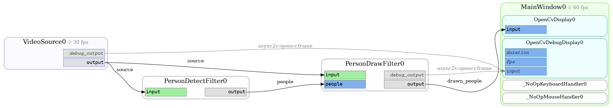

Asynchronous Filter
===================

This chapter of the tutorial shows you a pattern to perform expensive processing in an asynchronous way, while keeping
a smooth & fast video stream.

We start with the result of the previous chapter and modify the filter to use one of the OpenCV example HOG detectors
for person detection.

Because it is so simple and you can test it with your webcam and yourself running around in front of it, it serves as
a perfect example for this chapter. Also, the person detection is performance-hungry enough (as of current hardware)
to show the problem we get with the synchronous approach.

The code examples included in this chapter are available as ready-to-run examples under ``examples/tutorial/03_*.py``.

Try synchronous filter first
----------------------------

Apart from a bit of renaming, we modify the filter to do two things:

* Detect people on the input image
* Draw the detected people on a copy of the input image (this is our output image)

.. literalinclude:: ../../examples/tutorial/03_01.py
  :language: python
  :emphasize-lines: 17-33,50,51

As of now, that is not so different from our previous example. But if you run the example, you should notice that the
video stream is not running smooth anymore. When you switch to debug mode, you should see the reason: The processing
time for the ``PersonDetectFilter`` is very high. You should notice that the processing times of other components are
also increasing -- all components share the same thread, i.e. every computation done directly in one of the
``process()`` methods takes a bite out of the available CPU time of all components.

To solve this issue, we need to do two things.

Run the expensive operation in a separate thread
------------------------------------------------

First, we need to run the expensive ``detectMultiScale`` call in a separate thread, allowing the asyncio main loop to
continue and process the other components. For this, async2v has a convenience utility method `run_in_executor`, which
is basically just a very thin wrapper around the corresponding asyncio method:

.. literalinclude:: ../../examples/tutorial/03_02.py
  :language: python
  :emphasize-lines: 26,34-35

This should already be a huge improvement, as now the application can continue to run the process steps in other
components while the person detection is done, especially updating the main window and reading from the video source.

But we can do better.

Extract the expensive operation into an asynchronous component
--------------------------------------------------------------

The framerate of the main display is still limited to the framerate of the ``PersonDetectFilter``.
This bottleneck can be bypassed by using the last known detected persons as long as we don't get new ones, but keep
drawing them on the current video images as they arrive. For this, we need to separate detection and drawing of
persons into two components -- an asynchronous ``PersonDetectorFilter`` and a synchronous ``PersonDrawFilter``.

.. literalinclude:: ../../examples/tutorial/03_03.py
  :language: python
  :emphasize-lines: 20,22,28,34-49,66-68

Now we get a smooth video stream, no matter how slow the person detector runs. Every time the detection finishes,
a new list of people is pushed to the ``people`` event key. From then on, the ``PersonDrawFilter`` uses that list to
draw the rectangles on the video frames. The only downside is that outdated rectangles are drawn onto the video stream.
But usually, a smooth video stream is preferable.

There are a few more things to notice:

* The ``PersonDrawFilter`` now has two input fields -- a triggering one and a non-triggering. This is intentional --
  we always want to process every input image when it arrives, but we don't need to send an extra frame when a detection
  step is complete.
* There is a ``None`` check for the ``people`` input. This is necessary, as the processing step can be triggered before the
  first ``people`` event has arrived. In that case, ``people.value`` is ``None``.
* The ``PersonDetectFilter`` does not push frames to the debug event key, as it does not produce frames directly --
  the debug display would not know how to handle the list of ``people`` pushed to the ``people`` event key.

Draw a component diagram
------------------------

We see that the synchronous ``PersonDrawFilter`` lies on the path of our video live stream, while
the asynchronous ``PersonDetectFilter`` is bypassed.
